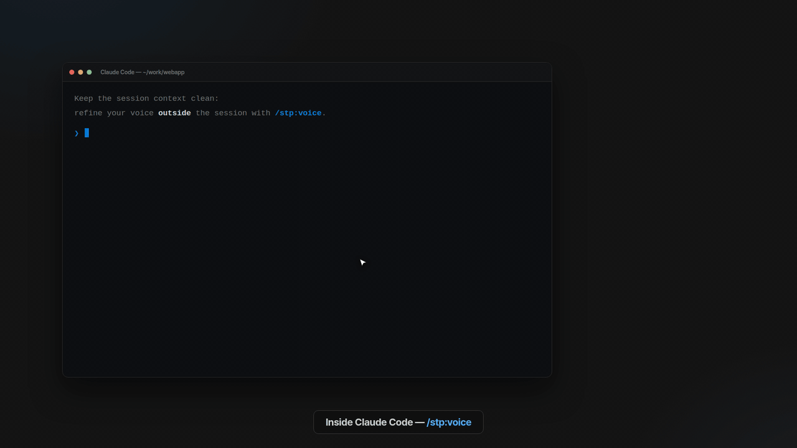
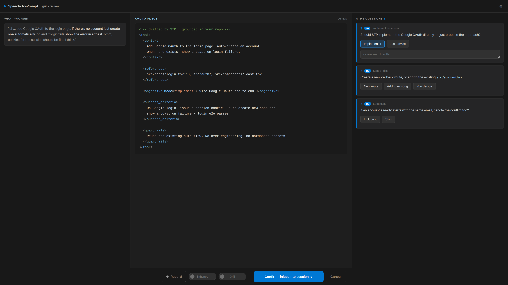

# Speech-To-Prompt (STP)

> Compile rough spoken developer intent into **one structured XML coding-agent prompt**.
> **Speech → Prompt**, not just Speech → Text.

**Status: 🚧 Pre-release.** Direct install works today (see below); Linux is
verified end-to-end, macOS/Windows validation and a marketplace listing are in
progress.

STP is a [Claude Code](https://claude.com/claude-code) plugin that captures your
voice, transcribes it locally (Whisper), and runs a repo-grounded "grill" loop
to produce a single, confirmed, structured XML prompt for your coding agent —
instead of pasting raw, rambling dictation. That goes for new tasks and for the
fifteen corrections you owe your agent after reviewing its work.



## When to reach for it

- **Kicking off a task.** Your plan is half-formed and talking it out is how
  you think. Ramble; the grill loop asks about what you left out.
- **Dumping a vague idea.** Speak out of order, contradict yourself, circle
  back — structuring it is STP's job, not yours. You review the result, not
  your own transcript.
- **A pile of corrections.** You reviewed the agent's work and have fifteen
  nitpicks. Talk through them once; repo-grounding pins "that button, the one
  in the header" to real files and symbols, and they come out as one organized
  change order.
- **Getting truly aligned with your agent.** The question loop surfaces the
  assumptions you didn't know you were making — and the XML you confirm is a
  contract you both agreed to, not a guess the agent ran with.

## Why

- **Thinking out loud** is faster and more intuitive than typing.
- **Raw transcription isn't usable** — speech carries filler and unstructured phrasing.
- **Refining inside your agent session wastes context** — so STP refines outside it
  and injects only the final, confirmed prompt.
- **Claude prefers structured (XML) input** — so STP turns voice straight into
  XML. The confirmed XML doubles as a statement of work you and your agent
  actually agreed on.

## Principles

- **Local-first & zero-infra** — local Whisper STT; your existing Claude Code
  session is the brain. No accounts, no servers, **zero telemetry**. Optional
  BYOK (Anthropic / OpenAI / ElevenLabs) is planned, not shipped yet.
- **Voice-first, always editable** — a local web popup captures speech and lets
  you review/edit/confirm before anything is injected.
- **Cross-platform & vendor-neutral.**
- **MIT, free forever** — a hobby project.

## Install

Inside Claude Code:

```
/plugin marketplace add jsk4581/speech-to-prompt
/plugin install stp@jsk4581
```

(or from a terminal: `claude plugin marketplace add jsk4581/speech-to-prompt`
then `claude plugin install stp@jsk4581`.)

**Requirements:** [Claude Code](https://claude.com/claude-code) and Node.js ≥ 18
(with npm). **On macOS also** `brew install whisper-cpp` — whisper.cpp publishes
no prebuilt macOS CLI, so STP uses the Homebrew one (the popup reminds you if
it's missing).

Then run `/stp:voice` in any session. The first run builds the small local
helper and downloads a Whisper model (~75 MB–0.9 GB depending on the recommended
tier for your machine) — after that, everything is local and offline-capable.

## Use



1. `/stp:voice` — a local popup opens (127.0.0.1 only, per-run token).
2. Hit record and talk through what you want built (any length; stop when done).
3. STP transcribes locally and drafts a structured XML task from what you said —
   and only what you said: a section you gave no material for simply doesn't
   exist. Two footer toggles set the recipe, and flipping one mid-review
   redrafts live:
   - **Enhance** (off by default) — adds a restrained repo-refined variant in a
     second tab beside the faithful draft; Confirm injects whichever tab is open.
   - **Grill** (off by default) — STP asks the few questions that are expensive
     to get wrong (implement vs. advise, scope, success criteria). Answers stay
     local until you confirm.
4. Edit the XML directly if you like, then Confirm — your answers are folded
   in, and exactly one validated XML prompt is injected into your session.

## Permissions & what STP touches

A microphone tool should be explicit about its footprint:

- **Microphone** — captured by *your browser* (getUserMedia) in the local popup;
  the browser owns the permission prompt. The helper process never opens the
  mic itself. The popup pre-opens the mic on load so your first word isn't
  clipped, and releases it after ~30 s without a Record press (your OS's
  recording indicator reflects this); it is fully released when you close the
  tab or stop recording.
- **Network** — first run only: downloads a prebuilt
  [whisper.cpp](https://github.com/ggerganov/whisper.cpp/releases) CLI from its
  official GitHub releases (Linux/Windows; on macOS the Homebrew install is
  used instead), a Whisper model from the official
  [`ggerganov/whisper.cpp`](https://huggingface.co/ggerganov/whisper.cpp)
  HuggingFace repo, and a small (~1 MB) voice-activity-detection model from
  [`ggml-org/whisper-vad`](https://huggingface.co/ggml-org/whisper-vad) that
  keeps trailing silence from hallucinating text — all into Claude Code's
  plugin data directory. After that, STP runs fully offline. **Zero telemetry
  — nothing ever phones home.**
- **Local server** — binds `127.0.0.1` only, authenticated with a per-run
  token; no other local process can read your transcript or inject a prompt.
- **Language** — transcription auto-detects by default. Whisper transcribes
  one language per recording, so if you mix languages heavily and a passage
  drops out, pin the language with the popup's footer selector (`STP_LANG`
  sets the launch default: `auto`/`ko`/`en`).

## License

MIT.
